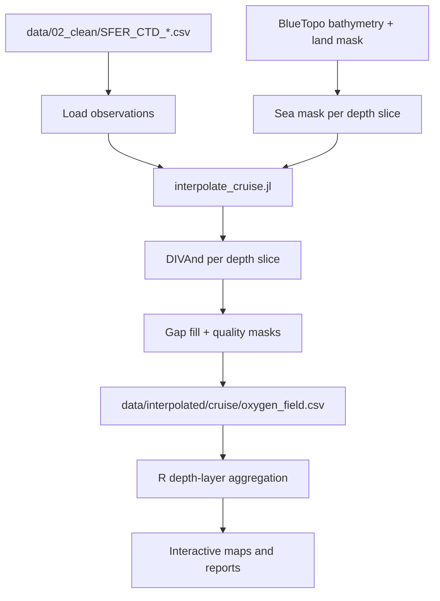

This page describes how [`scripts/interpolate_cruise.jl`](../scripts/interpolate_cruise.jl) transforms cleaned CTD casts in `data/02_clean/` into gridded dissolved oxygen fields in `data/interpolated/{cruise_id}/oxygen_field.csv`. Those fields power the [oxygen field maps](../cruise_oxygen/listing.qmd), [hypoxic depth maps](../cruise_hypoxic_depth/listing.qmd), and [hypoxic extent summaries](hypoxic_extent.qmd).

Run interpolation after processing:

```bash
make process
make interpolate              # one cruise (default CRUISE=SV18067)
make interpolate CRUISE=WS0612
make interpolate-all          # every cruise with cleaned data
```

## Overview

Interpolation is performed **independently at each depth level**. For a given depth slice, the method:

1. Selects CTD observations within a vertical tolerance of that depth.
2. Builds a sea mask from [BlueTopo](https://www.ncei.noaa.gov/products/blue-topo-bathymetry) bathymetry and a coastline land mask.
3. Connects isolated observations across shallow water where needed.
4. Runs **multiscale DIVAnd** (Data-Interpolating Variational Analysis) on each connected sea body.
5. Fills remaining gaps, then masks unreliable extrapolation and disconnected water bodies.

There is **no separate 3-D variational solve**. Vertical structure comes from stacking independent horizontal slices. Map displays then **aggregate** those slices into ecological depth bands (0–3 m, 3–10 m, etc.) in R.



## Input data

Each cruise uses all cleaned cast files matching `SFER_CTD_{cruise_id}_*.csv`. For every row with valid `longitude`, `latitude`, `depth` (or `sea_water_pressure`), and `dissolved_oxygen`, one observation is passed to the interpolator.

Casts are cleaned upstream by [`scripts/clean_bin_ctd.R`](../scripts/clean_bin_ctd.R): IOOS QARTOD QC filtering, spike trimming with `oce::ctdTrim()`, and decimation to ~0.1 dbar with `oce::ctdDecimate()`. See the [processing summary](processing_summary.qmd) for details.

## Algorithm: DIVAnd

The core interpolator is [DIVAnd.jl](https://github.com/gher-uliege/DIVAnd.jl) (`DIVAndrun` on a rectangular domain). DIVAnd finds a smooth field that fits observations while penalizing large spatial curvature. Two parameters control the trade-off:

| Parameter | Role |
|-----------|------|
| `len_horiz` | Correlation length (°). Larger values produce smoother fields that influence points farther from observations. |
| `epsilon2` | Signal-to-noise ratio. Higher values trust observations more relative to smoothness. |

This project uses a **multiscale** approach (`interpolate_surface_field_multiscale`):

1. **Background pass** — long correlation length (`0.10°`), moderate data fidelity (`epsilon2 = 3.0`). Captures broad regional gradients between widely spaced casts.
2. **Fine pass** — shorter correlation length (`0.045°`), moderate data fidelity (`epsilon2 = 0.5`). Adds local corrections on top of the background.

The final field is `background + fine_residuals`. Observations are mean-centered before each pass to improve numerical stability.

### Parameter tuning (large-scale variability)

Short correlation lengths and a very low fine `epsilon2` produce **localized “bubbles”** around each cast: the field matches observations within ~0.02° (~2 km), then relaxes toward the depth-slice mean by ~0.08°. On WS0612’s surface slice this reduced field variance to ~26% of cast-to-cast variance.

Parameters were tuned so the **background field spans several station spacings** (~0.05–0.08° on shelf transects) and both passes trust observations more:

| Parameter | Previous | Current | Why |
|-----------|----------|---------|-----|
| `LEN_HORIZ_BG_DEG` | 0.04° | **0.10°** | Background must connect casts on transects, not flatten toward the slice mean between them |
| `EPSILON2_BG` | 1.0 | **3.0** | Stronger fit to observations on the large-scale pass |
| `LEN_HORIZ_DEG` | 0.018° | **0.045°** | Fine residuals extend ~1 cast spacing instead of ~0.5 grid cells |
| `EPSILON2` | 0.01 | **0.5** | Fine pass was over-smoothing (50× weaker data weight than background) |

After tuning on WS0612, field standard deviation increased from 0.067 to 0.084 mg/L (cast SD 0.255), and mean deviation from the slice mean at 0.08–0.10° from the nearest cast rose from 0.027 to 0.078 mg/L — the shelf-scale gradient persists farther from stations.

When only one observation falls in a sea component, that value is assigned uniformly. When none fall in a component, the slice is left empty (NaN) until gap filling.

## Grid construction

The output grid spans the observation bounding box plus `0.02°` padding on each side.

| Setting | Default | Notes |
|---------|---------|-------|
| Horizontal target resolution | `0.005°` (~500 m) | Used to size the lon/lat axes |
| Vertical target resolution | `2.0 m` | Used to size the depth axis |
| Minimum axis length | 30 points | Floor on grid extent |
| Maximum axis length | 250 points | Ceiling per axis |
| Maximum total grid points | 1 500 000 | If exceeded, all three axes are scaled down equally |

Correlation lengths are expressed in **degrees** and set to span real station spacing, not just grid cell width (large cruises may use ~0.035° cells even when the target is 0.005°).

Depth levels are evenly spaced from the shallowest to deepest observed depth on the cruise. Actual grid spacing depends on cruise extent — large cruises may use coarser cells than the target resolution.

Depth slice tolerance (observations assigned to a level) is `max(1 m, half the native depth spacing)`.

## Bathymetry and sea masking

Bathymetry comes from **BlueTopo** at 8× the interpolation grid resolution (via [`scripts/download_bluetopo.py`](../scripts/download_bluetopo.py)). A separate **coastline land mask** is rasterized with [`scripts/rasterize_land_mask.py`](../scripts/rasterize_land_mask.py).

For each depth slice:

- **Land** — cells with unknown elevation or elevation ≥ `−0.2 m` are excluded.
- **Too shallow** — cells where bottom depth + tolerance < slice depth are excluded (prevents interpolating below the seafloor).
- **Observation override** — land-mask cells at cast locations are cleared so nearshore stations are retained.

### Connecting observations across barriers

Some casts fall in water bodies that are disconnected on the coarse grid (e.g. separated by land or missing bathymetry). Two mechanisms address this:

1. **`extend_sea_mask_along_water!`** — walks up to 8 grid steps from each observation through cells with valid sub-tidal elevation.
2. **`bridge_unconnected_observations!`** — for observations not in the main sea component, finds a shortest path through high-resolution bathymetry (up to 40 steps) and marks those cells as sea. Paths that cross land are rejected. Observations more than 24 grid cells from the main field are skipped.

After bridging, each depth slice is interpolated **separately per connected sea component** (`interpolate_by_sea_component`). Components with no nearby observations are masked out (`mask_disconnected_components!`).

## Post-processing and quality control

After DIVAnd runs for all depth levels:

### Depth-mean gap fill

Grid cells that are sea but still NaN (no observations contributed to that depth slice) are filled with the **mean dissolved oxygen of all observations in that depth slice**. If a slice has no observations at all, the cruise-wide mean for that slice index is used (or the global cruise mean as a last resort).

### Local observation clamping

Multiscale DIVAnd can overshoot the observation range — for example, producing a 1.5 mg/L grid value next to a station measuring 3.4 mg/L when the fine residual pass adds an large negative correction. To prevent this, each grid cell is **clamped** after gap filling:

```
clamped_value = clamp(interpolated_value, local_min, local_max)
```

where `local_min` and `local_max` are the minimum and maximum dissolved oxygen among all observations **in that depth slice** within **`0.10°`** of the cell center (`CLAMP_RADIUS_DEG`, equal to the background correlation length). Cells with no observations within that radius are left unchanged.

This keeps the field spanning the full grid extent while ensuring values near casts stay within the range of nearby measurements. It specifically targets ringing from the fine residual pass without flattening the entire slice to global min/max.

### Observation fit reporting

For each depth slice with observations, the script logs mean absolute residual, max absolute residual, and RMSE at observation grid cells. These appear in the console when running `make interpolate`.

The interpolated field spans the full sea mask within the cruise bounding box (including gap-filled cells). It is **not** clipped to a convex hull of observations, but values in data-sparse regions may be extrapolated beyond what casts directly support.

## Output format

Each cruise writes a long-format CSV:

| Column | Description |
|--------|-------------|
| `longitude` | Grid cell center (°) |
| `latitude` | Grid cell center (°) |
| `depth_m` | Depth level (m) |
| `dissolved_oxygen` | Interpolated O₂ (mg/L) |

Only sea cells with finite values are written. There is no pre-defined regular NetCDF grid; downstream R code treats the CSV as a scattered 3-D field.

Output path: `data/interpolated/{cruise_id}/oxygen_field.csv`

## How maps use the gridded field

The interpolated CSV is **not** displayed directly at native depth levels. Report maps aggregate into ecological layers defined in [`R/depth_layers.R`](../R/depth_layers.R):

| Layer | Depth range | Map label |
|-------|-------------|-----------|
| Neuston surface | 0–3 m | 0–3 m |
| Near-surface | 3–10 m | 3–10 m |
| Mixed layer | 10–50 m | 10–50 m |
| Circalittoral | 50 m – max depth | 50 m+ |

For each horizontal grid cell, all native depth levels falling in a layer are **averaged** (`aggregate_field_layer` in [`cruise_oxygen/depth_layers.R`](../cruise_oxygen/depth_layers.R)). CTD observations are averaged the same way for comparison on the map. Field cell popups include the nearest station and approximate distance.

## Key parameters reference

All constants are defined at the top of [`scripts/interpolate_cruise.jl`](../scripts/interpolate_cruise.jl):

| Constant | Value | Purpose |
|----------|-------|---------|
| `HORIZ_RES_DEG` | 0.005° | Target horizontal grid spacing |
| `DEPTH_RES_M` | 2.0 m | Target vertical grid spacing |
| `LEN_HORIZ_DEG` | 0.045° | Fine DIVAnd correlation length (~1 cast spacing) |
| `EPSILON2` | 0.5 | Fine data fidelity (signal-to-noise) |
| `LEN_HORIZ_BG_DEG` | 0.10° | Background correlation length (~several cast spacings) |
| `EPSILON2_BG` | 3.0 | Background data fidelity |
| `CLAMP_RADIUS_DEG` | 0.10° | Local observation search radius for post-interpolation clamping |
| `BBOX_PADDING_DEG` | 0.02° | Grid padding beyond observations |
| `LAND_ELEVATION_M` | −0.2 m | Land/sea threshold |
| `OBS_SEA_MAX_STEPS` | 8 | Sea-mask extension from casts (~2× for finer grid) |
| `OBS_BRIDGE_MAX_STEPS` | 40 | Max path length for observation bridging |
| `OBS_BRIDGE_MAX_GRID_DIST` | 24 | Max grid cells for bridging to main field (~2× for finer grid) |

## Limitations and interpretation

- **Sparse cruises** — With widely spaced stations, DIVAnd can produce smooth gradients and overshoot between casts. Local clamping keeps values near casts within the nearby observation range.
- **No cross-shelf dynamics** — Independent depth slices do not enforce physical vertical coherence (e.g. a subsurface minimum cannot inform the surface slice).
- **Single cruise per field** — Each interpolation uses one cruise's observations only. Multi-cruise summaries (e.g. hypoxia frequency) combine fields in R after interpolation.
- **Nearshore casts** — Land-mask overrides and bridging allow nearshore stations to contribute, but coastal geometry on a coarse grid can still affect which cells receive values.
- **Gap-filled cells** — Cells filled with the depth-slice mean carry no horizontal information; they appear as uniform patches across regions with no observations at that depth.

When investigating suspicious map features, compare the field cell to nearby CTD markers and read the nearest-station distance in the popup.

## Related files

| File | Role |
|------|------|
| [`scripts/interpolate_cruise.jl`](../scripts/interpolate_cruise.jl) | Main interpolation script |
| [`julia/Project.toml`](../julia/Project.toml) | Julia dependencies (DIVAnd, ArchGDAL, …) |
| [`scripts/download_bluetopo.py`](../scripts/download_bluetopo.py) | Fetch BlueTopo for cruise extent |
| [`scripts/rasterize_land_mask.py`](../scripts/rasterize_land_mask.py) | Build coastline land mask |
| [`R/depth_layers.R`](../R/depth_layers.R) | Ecological depth layer definitions |
| [`cruise_oxygen/depth_layers.R`](../cruise_oxygen/depth_layers.R) | Map payload aggregation |
| [`cruise_oxygen/plot_oxygen_map.R`](../cruise_oxygen/plot_oxygen_map.R) | Interactive field map |
| [`cruise_hypoxic_depth/hypoxic_depth.R`](../cruise_hypoxic_depth/hypoxic_depth.R) | Shallowest hypoxic depth from field |
